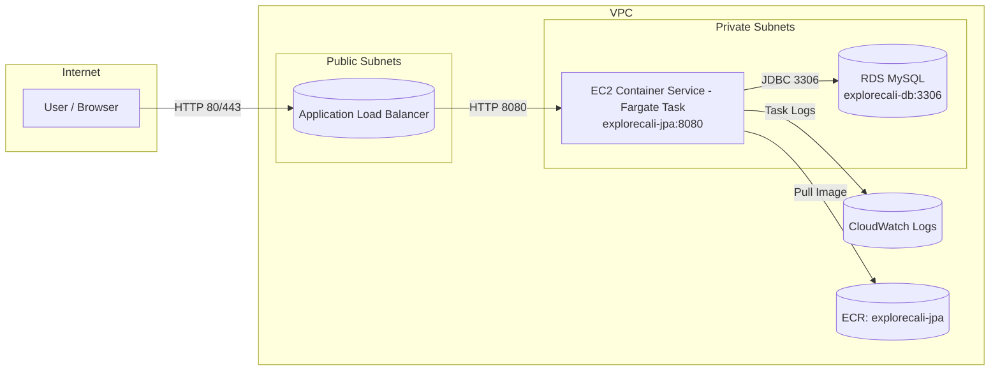
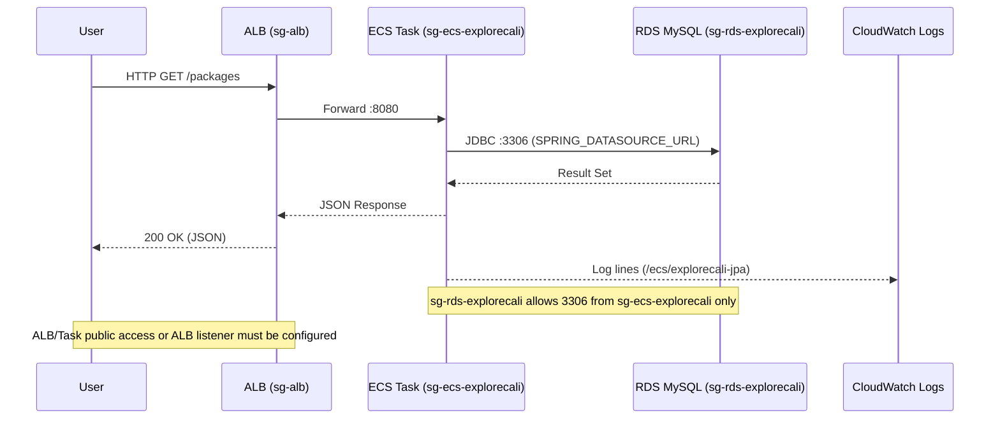
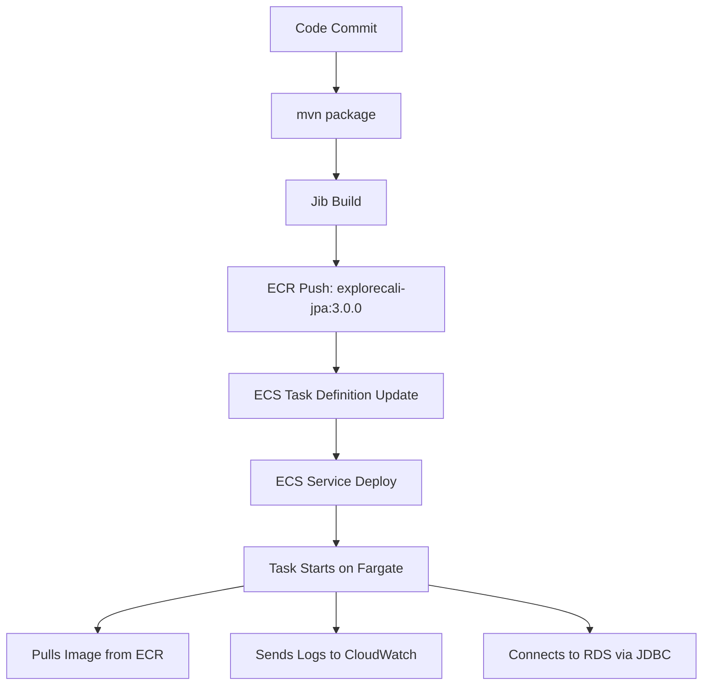

# Explore California JPA Service

This project is a Spring Boot microservice that stores data in MySQL. It is simplified to a single JPA service and includes Docker Compose for local testing.

## Prerequisites

- Java 17+
- Docker and Docker Compose

## Build and Test

Run the unit tests and build the Docker image using the Maven wrapper:

```bash
./mvnw test
./mvnw -DskipTests compile jib:dockerBuild
```

The `jib:dockerBuild` goal creates a local image tagged `explorecali-jpa:3.0.0`.

## Run with Docker Compose

Start the application and MySQL database:

```bash
docker compose up
```

Docker Compose launches a `mysql-db` service and a `jpa-app` service.

## Exercise the API

After both containers are up, interact with the REST endpoints:

```bash
# Create a tour package
curl -X POST http://localhost:8080/packages \
  -H 'Content-Type: application/json' \
  -d '{"code":"BB","name":"Beekeepers you Betcha"}'

# List tour packages
curl http://localhost:8080/packages

# Delete the tour package
curl -X DELETE http://localhost:8080/packages/BB
```

Use `docker compose down` to stop the services when finished.

Awesome — here’s a **drop-in README.md** that includes **Mermaid diagrams** for the VPC/ECS/RDS architecture and the request flow. You can paste this directly into your repo.

---

# 🚀 CS-460 Explore California JPA – AWS Deployment Lab

This lab walks you through deploying the **Explore California JPA** project to **AWS ECS (Fargate)** using **ECR, RDS, VPC, and CloudWatch**. By the end, you’ll have a fully running backend API accessible through ECS.

---

## ✅ Verification Checklist

* **Networking**

  * VPC and at least **two subnets** confirmed
  * RDS Subnet Group with **two private subnets**
* **Security & Access**

  * Security group `ecs-explorecali` (8080 inbound from **My IP**)
  * Security group `rds-explorecali` (3306 inbound from **sg-ecs-explorecali**)
* **ECS & RDS Setup**

  * ECR repo `explorecali-jpa` with an image pushed
  * CloudWatch Log Group `/ecs/explorecali-jpa`
  * RDS MySQL instance **explorecali-db** (endpoint noted, DB `explorecali` created)
  * **IAM Task Execution Role** attached in task definition
  * **ECS Cluster** created
  * **Task Definition (Fargate)** with port **8080** and DB env vars
  * **ECS Service** running **1 task** (public IP or behind ALB)
* **Validation**

  * Hitting `/packages` returns data
  * Logs visible in **CloudWatch**

---

## 📝 Step-by-Step Instructions

### 1) Accept the Vocareum Lab & Initial AWS Setup

Follow the PDF: **CS-460 Explore California JPA AWS Lab – Visual Guide.pdf**

### 2) Build and Push the Docker Container

**Configure AWS CLI (in VS Code):**

```ini
# ~/.aws/config
[default]
region = us-east-1
output = json
```

```ini
# ~/.aws/credentials
[default]
aws_access_key_id=...
aws_secret_access_key=...
aws_session_token=...
```

**Verify AWS CLI:**

```bash
aws s3 ls
```

**Build + Push with Jib:**

```bash
mvn package

export AWS_REGION=us-east-1
export AWS_ACCOUNT_ID=$(aws sts get-caller-identity --query Account --output text)

aws ecr get-login-password --region us-east-1 \
  | docker login --username AWS --password-stdin \
    $AWS_ACCOUNT_ID.dkr.ecr.$AWS_REGION.amazonaws.com

./mvnw -DskipTests compile jib:build \
  -Dimage=$AWS_ACCOUNT_ID.dkr.ecr.$AWS_REGION.amazonaws.com/explorecali-jpa:3.0.0
```

### 3) Complete AWS Setup

Follow the PDF: **CS-460 Explore California JPA ECS Deployment AWS Lab – Visual Guide.pdf**

---

## ⚙️ Environment Variables (Task Definition)

```env
SPRING_DATASOURCE_URL=jdbc:mysql://<RDS_ENDPOINT>:3306/explorecali?useSSL=false&allowPublicKeyRetrieval=true&serverTimezone=UTC
SPRING_DATASOURCE_USERNAME=admin
SPRING_DATASOURCE_PASSWORD=<YOUR_PASSWORD>
SPRING_JPA_HIBERNATE_DDL_AUTO=update
SPRING_SQL_INIT_MODE=always
```

* `<RDS_ENDPOINT>` → from the RDS console (Endpoint)
* `<YOUR_PASSWORD>` → password used when creating the RDS DB

---

## 🧭 Architecture (Mermaid Diagrams)

### 1) High-Level AWS Architecture



### 2) Request Flow & Security Groups



### 3) Build & Deploy Pipeline



---

## 🛠 Troubleshooting Guide

### ❌ Task Fails to Start

* **IAM**: Task Execution Role needs ECR (pull) and CloudWatch (logs) permissions.
* **Logs**: Open CloudWatch group `/ecs/explorecali-jpa` for stack traces.

### ❌ Can’t Connect to Database

* **Security Groups**: `sg-rds-explorecali` must allow **3306 from sg-ecs-explorecali** (not from 0.0.0.0/0).
* **Env Vars**: Check `SPRING_DATASOURCE_URL/USERNAME/PASSWORD`.
* **DB Exists**: Confirm database `explorecali` exists on the instance.

### ❌ `/packages` Errors or Empty

* Ensure `SPRING_SQL_INIT_MODE=always` so schema/data init runs.
* Verify Hibernate DDL: `SPRING_JPA_HIBERNATE_DDL_AUTO=update`.

### ❌ Image Not Found

* Tag matches in ECR and Task Def: `.../explorecali-jpa:3.0.0`.
* After pushing, **create or update** the Task Definition to use the new tag.

### ❌ Service Running but No Public Access

* **Public IP** mode: check the ENI’s public IP and route tables.
* **ALB mode**: Target Group health checks must succeed (path, port 8080). Listener on 80/443.

---

## 🎯 Completion Criteria

* `/packages` endpoint returns results ✅
* Logs visible in CloudWatch ✅
* ECS Service stable and healthy ✅

---

## 🙌 Notes

* Region assumed: `us-east-1`
* Single-task service is fine for the lab; for production, consider multiple AZs, secrets in AWS Secrets Manager, and health check paths.

---

